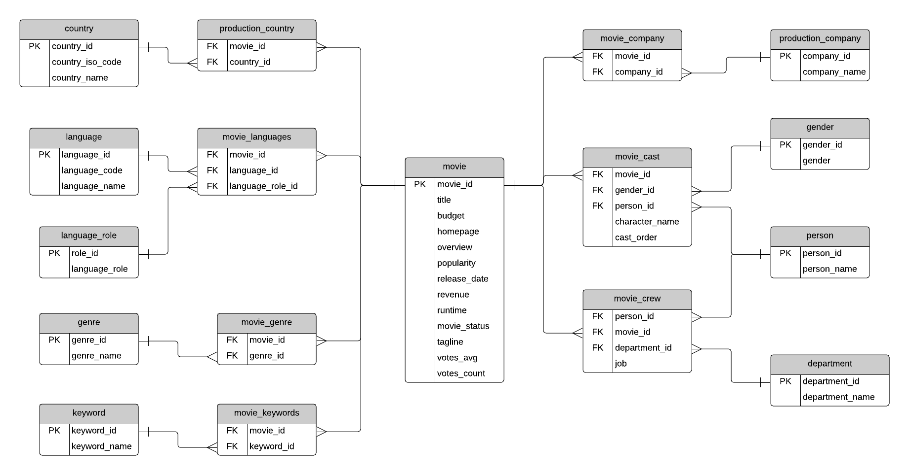

Here you can find a source code of the Docker image with MySQL set up. `MYSQL_ROOT_PASSWORD` is defined in Dockerfile and MySQL can be accessed over port 3306

#Data structure

#How to use it 

Build image by running this command:

    docker build -t mymdb-mysql:0.1  .

Start container by running this command:

    docker run -d --name mymdb-mysql --publish 3306:3306 mymdb-mysql:0.1

When container is running, you can access MySQL using this command:

    docker exec -it mymdb-mysql /bin/bash
    mysql -u root --password=password movies
   
